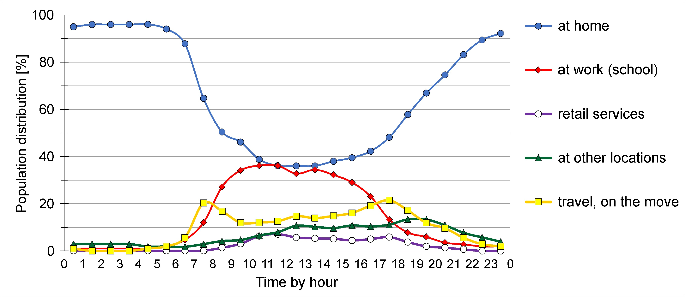

# Data

MFD interpolation model requires basically three different datasets that all has some specific characteristics:

 1. [Disaggregated physical surface layer](#disaggregated-physical-surface-layer)
 2. [Human activity data](#human-activity-data)
 3. [Mobile phone data](#mobile-phone-data)
 
Read a full description of these datasets from our [article](../README.md#scientific-article) and its supplementary information. 

Below we provide a few key points about the datasets that we have used
for our model and what is described in the article.  
 
## Disaggregated physical surface layer

#### 1. To prepare a physical surface layer in the MFD model:
 
 1. a land cover layer is created by aggregating land cover parcels based on six activity function classes as indicated in the table below. 
   This enables linking the land cover layer with the classification of building usage and human activity types
 
 2. building layer is prepared by refining building usage type and estimating total floor area. 
    
    - First, all buildings with a footprint area over 20 m2 are selected from the up-to-date building footprint layer 
    - These building units initially have the binary classification of a residential (or public) building and non-residential building. 
    - To further refine building classification according to six land use classes we applied the OSM database to obtain more detailed information 
    about activities and functionalities of buildings.
    
 3. The vertical dimension of buildings is taken into account. 
    
    - Since we do not have ready-made available data about the total floor area for each building, we calculated the estimated values based on the 
    building footprint area and building height.
    - We prefer to apply estimates for total floor area (m2) of buildings.
    - The average height for each building is calculated based on LIDAR measurement points at 1 m accuracy 
    obtained from the normalised Digital Surface Model, which intersects building footprint polygons.
    - To estimate the number of floors, the average building height is divided by the floor height set for 3.5 m for residential and 
    4.5 m for other buildings
 
 4. Overlay method is then applied to calculate the geometric union of a land cover layer with a building layer. In the case of building polygons, only building attributes remain. 
 For subunits with the surface unit type of land the default value for the number of floors is set to 1. 
 
Now, each disaggregated spatial subunit in the physical surface layer has three attributes: the number of floors, activity function type, and spatial unit type of either building or land.
   
| Activity function type | Land parcels by land cover type | Building units by functionality type | Human activity type |
|------------------------|---------------------------------|--------------------------------------|---------------------|
| Residential | residential area | residential, accommodation, prison | at home or accommodation |
| Work	| industrial and business area | industrial, office, public institutions predominantly not for in situ services (e.g. police department, hospital, town hall), educational | at work or school |
| Retail & Service | | retail and service (e.g. gas station, cleaner service, local bank branch) | shopping and using services |
| Other | open area (e.g. park, square), forest, cemetery |	public institutions for in situ services (e.g. libraries, sport facilities), leisure and entertainment, eatery, churches | other (leisure) activities |
| Transport |	transport networks (e.g. road, railway, parking) | | travelling, on the move |
| Restricted | | water, wetland, arable land, restricted area (e.g. wasteland) | not accessible, no activity |

   
#### 2. To prepare a disaggregated physical surface layer

In the second step: 

 1. a geometric union with the physical surface layer, the layer representing Voronoi polygons as theoretical coverage areas of a base station (source zones) 
 and the official statistical grid cell layer (target zones) is applied to designate a unique base station ID and a unique official statistical grid cell 
 ID for each spatial unit in the physical surface layer.
 
 2. Then, the area for each disaggregated subunit polygon is calculated, which enables a calculation of the estimated total floor FA for each spatial subunit 
 by multiplying area with the number of floors. 
 
 3. This allows for a calculation of a relative floor area RFA for each subunit within a base station from the sum of FA within the given base station, 
 as illustrated in the table below.
 
| Subunit ID | Base Station ID (source zones) |	Grid cell ID (target zones) | Activity function type | Spatial unit type | Area \[km2\] | Number of floors | FA \[km2\] | RFA \[%\] |
|------------|--------------------------------|-----------------------------|------------------------|-------------------|--------------|------------------|------------|-----------|
| 10101 | 10| 10| residential    | building | 10 | 5 | 50 | 0.29 |
| 10201 | 10| 20| residential    | land	    | 10 | 1 | 10 | 0.06 |
| 10202 | 10| 20| work           | building | 10 | 3 | 30 | 0.18 |
| 10203 | 10| 20| work           | land	    | 10 | 1 | 10 | 0.06 |
| 10301 | 10| 30| retail&service | building | 10 | 5 | 50 | 0.29 |
| 10302 | 10| 30| restricted     | land     | 10 | 1 | 10 | 0.06 |
| 10303 | 10| 30| transport      | land	    | 10 | 1 | 10 | 0.06 ||
| **Total** | | | |  |	**70** |	| **170** |	**1.0** |

## Human activity data

The physical surface layer is linked with data on **human activity in time**. 

 - We apply the time usage of people by activity type on working days (Mon.–Fri.) which is based on the time use survey (Eurostat). 
 - The average hourly distribution of people by activity type is calculated based on the average time usage of people by activity type 
 for each hour of a day at an aggregated level (see figure below).
 - Temporally sensitive human activity information is incorporated to disaggregated spatial subunits in the physical surface layer by linking 
 human activity type with activity function type of subunits. 

 

Time specific human activity data per function type that we use is in a following format (an example):
 
| Activity_function_type  |	Spatial_unit | Seasonal factor | H12t | H13t | H20t |
|-------------------------|--------------|-----------------|------|------|------|
| Residential   | building | 0.9  | 21 | 36.1 | 36.1 | 74.6 |
| Residential   | area     | 0.1  | 21 | 36.1 | 36.1 | 74.6 |
| RetailService | building | 0.9  | 70 | 5.7  | 5.3  | 1.4  |
| Other         | area     | 0.1  | 66 | 10.7 | 10.2 | 10.9 |
| Other         | building | 0.9  | 1  | 10.7 | 10.2 | 10.9 |
| Transport     | area     | 0.1  | 11 | 14.8 | 13.9 | 9.6  |
| Restricted    | area     | 0.1  | 55 | 0.0  | 0.0  | 0.0  |
| Work          | building | 0.9  | 0  | 32.8 | 34.4 | 3.5  |

### Note

In the Python implementation of the model, you should name the columns representing the probability for human presence at specific activity function type at specific time of the day as `H9t`.   

Hence, the column name should start with capital 'H' -letter (*hour*), numbers informs the hour of the day, and the column name should end with lower 't' -letter (*time-use*).  

## Mobile phone data

The mobile phone data (Call Detail Records) that we use is in a following format (an example):

| BaseStation_ID  |	H12m | H13m | H20m |
|-----------------|------|------|------|
| 1001 | 50  | 65  | 21 | 
| 1002 | 80  | 123 | 70 |
| 1003 | 130 | 234 | 66 |
| 1004 | 18  | 11  | 1  |
| 1005 | 59  | 40  | 11 |
| 1006 | 100 | 84  | 55 |
| 1007 | 8   | 15  | 0  |

### Note

In the Python implementation of the model, you should name the columns representing the amount of mobile phone users registered on a specific base station at specific time of the day as `H9m`.   

Hence, the column name should start with capital 'H' -letter (*hour*), numbers informs the hour of the day, and the column name should end with lower 'm' -letter (*mobile-phone-user*).  

